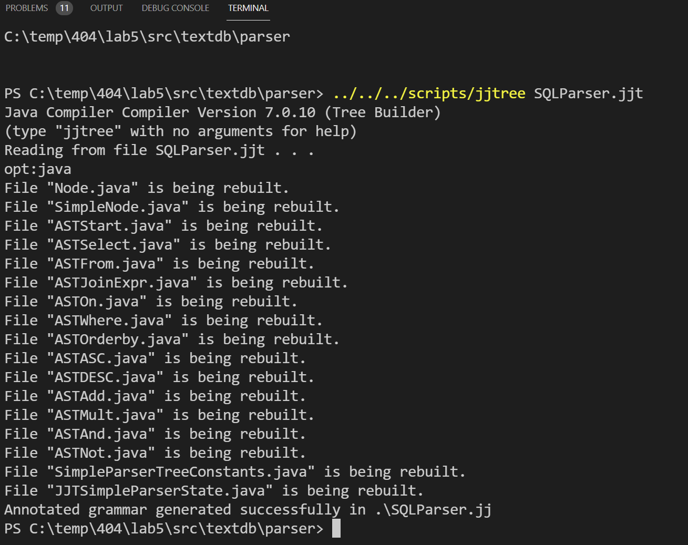
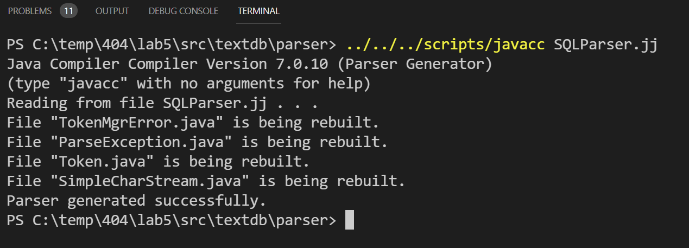

# COSC 404 - Database System Implementation Lab 5 - Query Parsing with JavaCC

This lab practices parsing using JavaCC.

## Query Parsing with JavaCC (20 marks)

This question uses the JavaCC parser to translate SQL queries into execution plans.  [JavaCC](https://javacc.org/) is a Java-based parser generator.  You can use it to make parse trees using the JJTree component.  

Our goal is to add ORDER BY support to the current system.  The code already supports a basic SQL parser in the file `parser/SQLparser.jjt` and a translation directly from the parse tree to an execution tree (using operators like you developed in assignment #3).

A setup and getting started checklist:

- JavaCC and JJTree are part of the code base. The library is `target\javacc.jar`. The two script files for compiling are `scripts/jjtree` and `scripts/javacc`.

- The test file is `junit/TestQuery.java`.

- Modify the `parser/SQLParser.jjt` file to support an ORDER BY clause of the form `ORDER BY attrName [ASC | DESC], (attrName [ASC | DESC])*`. You only will specify attribute names (no expressions) and must support if no ASC/DESC is specified (in which case it defaults to ASC).  There may be more than one attribute requested by the ORDER BY. (10 marks)

- Modify the `query/Optimizer.java` file to support execution of the ORDER BY clause you just created.  Note that we will limit support to only one attribute either ASC or DESC. (10 marks)

## Using JavaCC/JJTree

The best way to approach the assignment is to learn by example and copy existing code in `SQLParser.jjt`. Specifically, you will need to add two tokens `ASC` and `DESC` and one method `Orderby()`. The existing `From()` method is good to use as a starting point. Modify the `SQLParser.jjt` file. Then open a terminal, navigate to the directory `src/textdb/parser` and run the command: `../../../scripts/jjtree SQLParser.jjt`  This command will compile the grammar and generate the `SQLParser.jj` file in addition to other Java files.

If that is successful, run the command: `../../../scripts/javacc SQLParser.jj` to finish generating the parser by creating the Java files.

## Submission

The lab can be marked immediately by the professor or TA by showing the output of the JUnit tests and by a quick code review.  Otherwise, submit the URL of your GitHub repository on Canvas. **Make sure to commit and push your updates to GitHub.**
